<div align="center">



<br/>


<br/>

<a href="https://lazyer.tistory.com"></a> <a href="https://lazyerij.github.io"></a> <a href="https://stackoverflow.com/users/8282898/lazyer"></a> 

</div>


## `◦` whoami

```yaml
name:    김인주  ·  lazyer
role:    backend engineer
now:     퀀팃 / 올리팀 — RA '올리' 백엔드
since:   2018
focus:   [ python, django, graphql, kubernetes ]
license: [ 정보처리기사 ]
hobby:   [ 피아노, 리그오브레전드, 개발 스터디, stackoverflow ]
motto:   "잘 좀 하자"
```


## `◦` trace

<div align="center">

</div>

<details>
<summary><b>펼쳐서 자세히 보기</b></summary>

<br/>

| 기간 | 소속 | 한 일 | 쓴 것 |
|---|---|---|---|
| `2018.08 – 2019.02` | **솔미테크** | ECG Peak Detection 알고리즘 · 부정맥 분류 모델 · 독거노인 관리시스템 · 헬스케어 카메라 온보드 | Python, C, Keras, Flask, PostgreSQL, WebSocket |
| `2020.03 – 2022.11` | **씨즈데이터** · 개발팀 | OCR 수행 속도 개선 · 정보분류/요약 배치 · 건강보험 요약엔진 · 마이데이터 API · ADMS · AWS 구축·운용 | Django, PostgreSQL, AWS, Redis, Celery, nGrinder |
| `2022.12 – 2023.04` | **에잇퍼센트** · 대외계 | 신용정보원 전문 집중 · 카카오뱅크 연계 시스템 구축 | Django, Serverless, Kafka |
| `2023.04 – ` | **퀀팃** · 올리팀 | RA '올리' 서비스 백엔드 개발 · 인프라 및 배포 파이프라인 운영 | Django, GraphQL, Kubernetes, ArgoCD, Grafana, Prometheus, RabbitMQ, Celery |

</details>


## `◦` stack

<div align="center">



<br/>

      

        

</div>


## `◦` record

<div align="center">

| | 대회 / 기록 | 결과 |
|:--:|---|:--:|
| 🥇 | Digital Forensics Challenge 2019 | **Rank 1** |
| 🥉 | Kaggle — NFL Big Data Bowl | **Top 8%** |
| 📈 | Dacon — 전체유형 분류 | 7 / 940 |
| 📈 | Dacon — 주차수요 예측 | 19 / 1427 |
| 📈 | Dacon — 공공데이터 온도추정 | 55 / 1222 |
| 📈 | Dacon — Predict Future Sales | 21st |
| 🏠 | Kaggle — House Prices | Top 6% |
| 🚢 | Kaggle — Titanic | Top 13% |
| 📄 | 1차원 합성곱 신경망에 기반한 부정맥 분류 시스템의 설계 | 논문 |
| 🎓 | Coursera — Machine Learning / Deep Learning | 수료 |

</div>


## `◦` signals

<div align="center">



<br/>

<sub>이 패널은 외부 위젯 서비스가 아니라 <code>scripts/gen_stats.py</code>가 GitHub API로 직접 그리고, 매일 Actions가 갱신합니다.</sub>

</div>


## `◦` principles

```
1. make it boring        — 놀라운 일이 생기면 그건 장애다
2. make it observable    — 안 보이는 건 내 것이 아니다
3. make it deletable     — 언제든 걷어낼 수 있어야 한다
```

<br/>

<div align="center">


<sub>게으른 게 아니라, 두 번 하기 싫은 겁니다.</sub>

<br/>

<sub><code>lazyer</code> · always compiling</sub>

</div>
